# LAPORAN PRAKTIKUM PEMROGRAMAN DASAR DART – BAG. 2

Nama : Satria Abrar S.W.P  
Kelas : 3B/25

## Praktikum 1

### Langkah 1
Ketik atau salin kode program berikut ke dalam fungsi main(). 
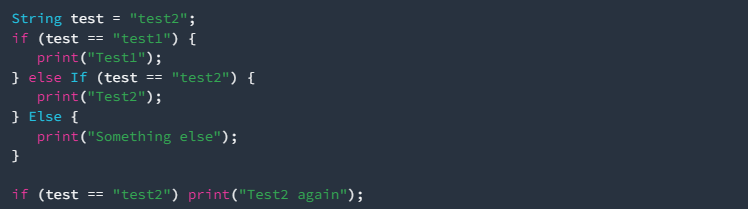

### Langkah 2
Silakan coba eksekusi (Run) kode pada langkah 1 tersebut. Apa yang terjadi? Jelaskan! 
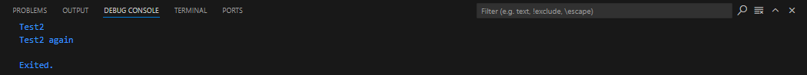 
Kode tersebut menggunakan percabangan if-else untuk memeriksa nilai variabel test yang berisi "test2". 
- Jika test == "test1", maka akan mencetak "Test1".
- Jika test == "test2", maka mencetak "Test2".
- Jika tidak ada kondisi yang terpenuhi, akan mencetak "Something else".
- Setelah itu, ada pengecekan lain untuk test == "test2", dan jika benar, mencetak "Test2 again".

### Langkah 3
Tambahkan kode program berikut, lalu coba eksekusi (Run) kode Anda. 
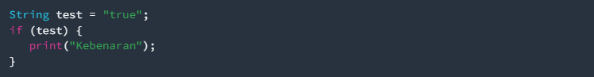 
Apa yang terjadi ? Jika terjadi error, silakan perbaiki namun tetap menggunakan if/else. 
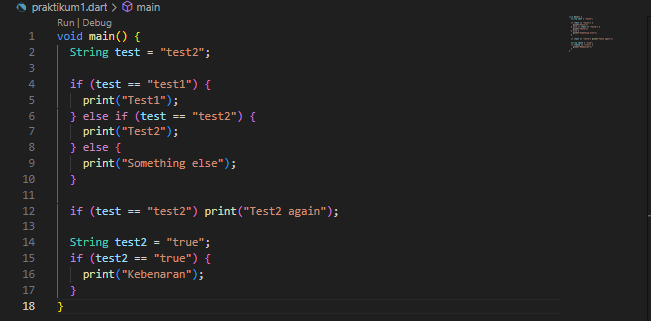
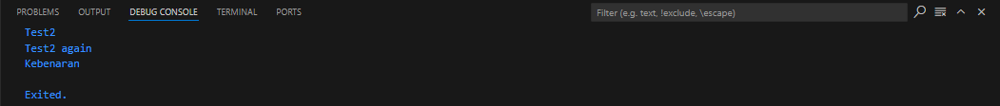 
Variabel test dideklarasikan dua kali dengan nama yang sama di dalam satu fungsi, yang menyebabkan konflik. Kemudia pada baris ini: if (test) tidak dapat dilakukan pengecekan kebenaran pada sebuah string langsung, seharusnya test dibandingkan dengan nilai boolean atau string "true".

## Praktikum 2

### Langkah 1
Ketik atau salin kode program berikut ke dalam fungsi main(). 
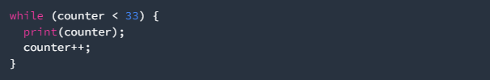

### Langkah 2
Silakan coba eksekusi (Run) kode pada langkah 1 tersebut. Apa yang terjadi? Jelaskan! Lalu perbaiki jika terjadi error. 
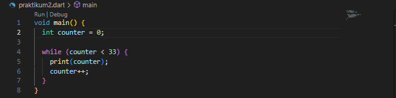 
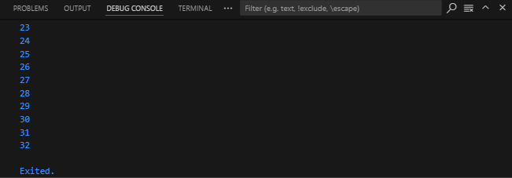 
Kode program sebelumnya terjadi eror, variabel counter harus dideklarasikan dengan tipe data int dan diinisialisasi dengan nilai awal, misalnya 0, sebelum digunakan dalam loop.

### Langkah 3
Tambahkan kode program berikut, lalu coba eksekusi (Run) kode Anda. 
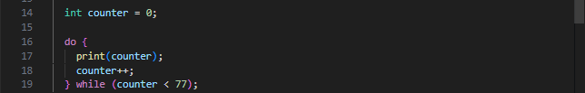 
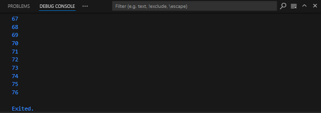 
Kode program sebelumnya terjadi eror, variabel counter harus dideklarasikan dengan tipe int dan diinisialisasi, misalnya dengan nilai 0.

## Praktikum 3

### Langkah 1
Ketik atau salin kode program berikut ke dalam fungsi main(). 
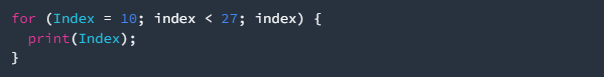 

### Langkah 2
Silakan coba eksekusi (Run) kode pada langkah 1 tersebut. Apa yang terjadi? Jelaskan! Lalu perbaiki jika terjadi error. 
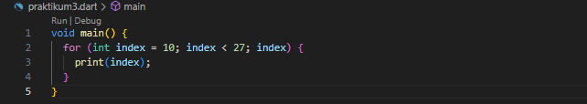 
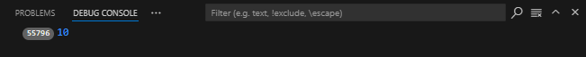 
Kode program sebelumnya terjadi eror, variabel Index harus dideklarasikan dan diinisialisasi dengan benar.

### Langkah 3
Tambahkan kode program berikut di dalam for-loop, lalu coba eksekusi (Run) kode Anda. 
 
Apa yang terjadi ? Jika terjadi error, silakan perbaiki namun tetap menggunakan for dan break-continue. 
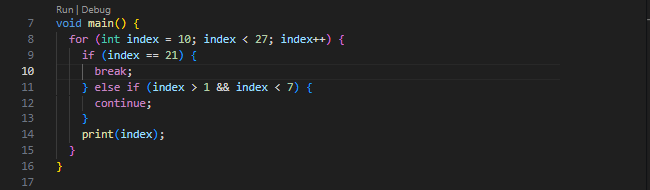 
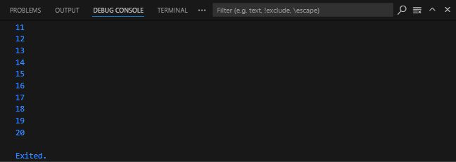

## Tugas Praktikum
Buatlah sebuah program yang dapat menampilkan bilangan prima dari angka 0 sampai 201 menggunakan Dart. Ketika bilangan prima ditemukan, maka tampilkan nama lengkap dan NIM Anda. 
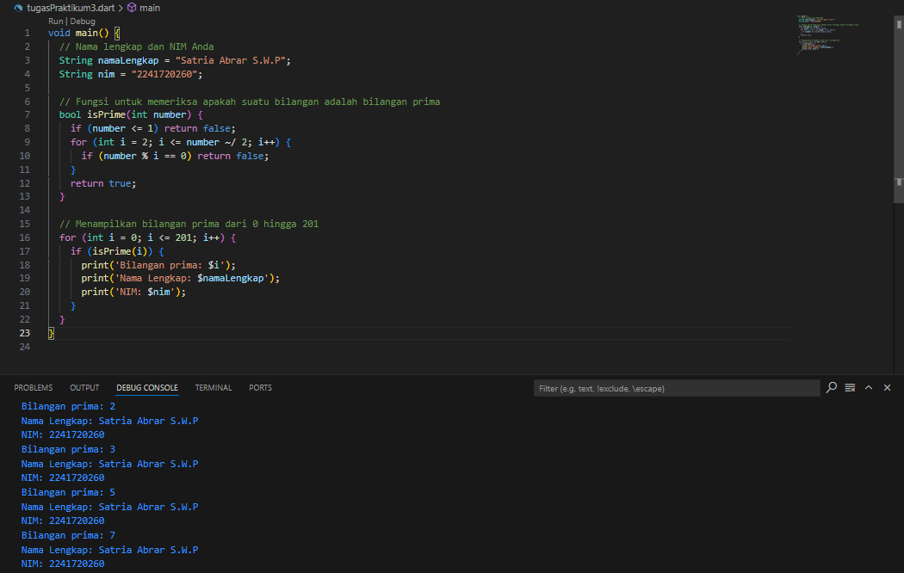