# LAPORAN PRAKTIKUM PEMROGRAMAN DASAR DART – BAG. 3

Nama : Satria Abrar S.W.P  
Kelas : 3B/25

## Praktikum 1

### Langkah 1
Ketik atau salin kode program berikut ke dalam fungsi main(). 
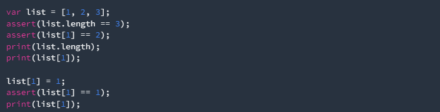

### Langkah 2
Silakan coba eksekusi (Run) kode pada langkah 1 tersebut. Apa yang terjadi? Jelaskan! 
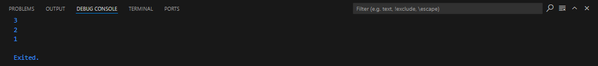 
Kode di atas membuat sebuah list dengan nilai `[1, 2, 3]`. Pertama, dilakukan pengecekan (`assert`) untuk memastikan panjang list adalah 3 dan nilai pada indeks ke-1 adalah 2. Jika kondisi ini terpenuhi, program berlanjut tanpa error. Setelah itu, program mencetak panjang list (yaitu 3) dan nilai pada indeks ke-1 (yaitu 2). Selanjutnya, nilai pada indeks ke-1 diubah dari 2 menjadi 1. Program kembali mengecek apakah perubahan ini berhasil dengan `assert`, memastikan nilai pada indeks ke-1 sekarang adalah 1. Terakhir, nilai yang baru pada indeks ke-1 dicetak (yaitu 1), menunjukkan bahwa perubahan tersebut berhasil dilakukan.

### Langkah 3
Ubah kode pada langkah 1 menjadi variabel final yang mempunyai index = 5 dengan default value = null. Isilah nama dan NIM Anda pada elemen index ke-1 dan ke-2. Lalu print dan capture hasilnya. 
Apa yang terjadi ? Jika terjadi error, silakan perbaiki. 
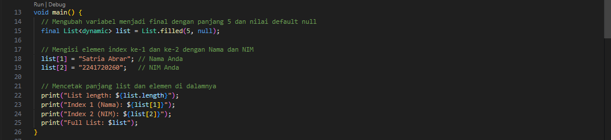 
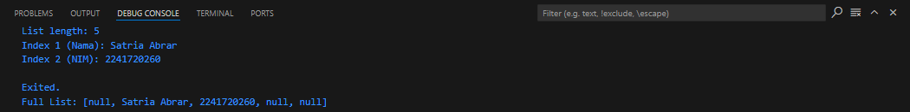

## Praktikum 2

### Langkah 1
Ketik atau salin kode program berikut ke dalam fungsi main(). 
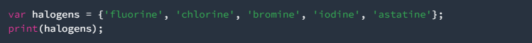

### Langkah 2
Silakan coba eksekusi (Run) kode pada langkah 1 tersebut. Apa yang terjadi? Jelaskan! Lalu perbaiki jika terjadi error. 
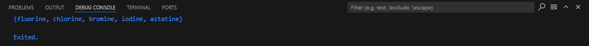 
Kode di atas mendefinisikan sebuah **set** bernama `halogens` yang berisi elemen-elemen kimia seperti `'fluorine'`, `'chlorine'`, `'bromine'`, `'iodine'`, dan `'astatine'`. Set merupakan struktur data yang tidak terurut dan tidak mengandung elemen duplikat. Setelah set diinisialisasi, program akan mencetak isi set tersebut menggunakan perintah `print`. Karena set tidak terurut, urutan elemen yang dicetak mungkin berbeda dari urutan saat set dideklarasikan. Set ini digunakan untuk menyimpan kumpulan elemen secara unik tanpa memperhatikan urutannya.

### Langkah 3
Tambahkan kode program berikut, lalu coba eksekusi (Run) kode Anda. 
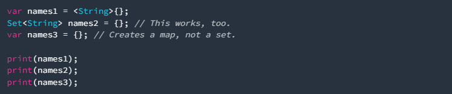 
Apa yang terjadi ? Jika terjadi error, silakan perbaiki namun tetap menggunakan ketiga variabel tersebut. Tambahkan elemen nama dan NIM Anda pada kedua variabel Set tersebut dengan dua fungsi berbeda yaitu .add() dan .addAll(). Untuk variabel Map dihapus, nanti kita coba di praktikum selanjutnya. 
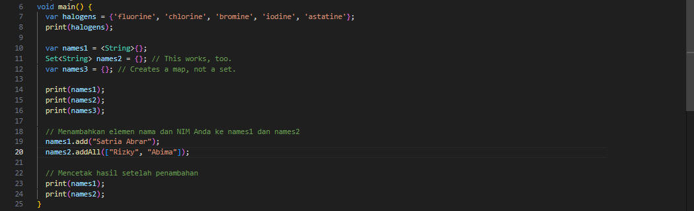 
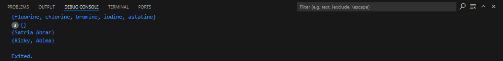 
Kode di atas mendefinisikan sebuah fungsi main() yang berisi beberapa operasi terkait set di Dart. Pertama, sebuah set bernama halogens diciptakan, yang berisi elemen-elemen kimia seperti 'fluorine', 'chlorine', 'bromine', 'iodine', dan 'astatine', dan kemudian dicetak ke konsol. Selanjutnya, dua set kosong dideklarasikan: names1 sebagai set bertipe String dan names2 yang juga bertipe Set<String>, sedangkan names3 dideklarasikan sebagai map kosong, yang perlu diperhatikan karena bukan merupakan set. Setelah itu, hasil dari ketiga variabel tersebut dicetak, di mana names1 dan names2 akan menampilkan {} karena keduanya kosong, dan names3 juga akan menampilkan {}. Selanjutnya, elemen ditambahkan ke dalam set: nama "Satria Abrar" ditambahkan ke names1 menggunakan metode .add(), sementara dua nama lain, "Rizky" dan "Abima", ditambahkan ke names2 menggunakan metode .addAll(). Terakhir, hasil dari penambahan elemen tersebut dicetak ke konsol, yang menunjukkan names1 berisi {"Satria Abrar"} dan names2 berisi {"Rizky", "Abima"}, mencerminkan keberhasilan dalam menambahkan elemen ke dalam kedua set.

## Praktikum 3

### Langkah 1
Ketik atau salin kode program berikut ke dalam fungsi main(). 
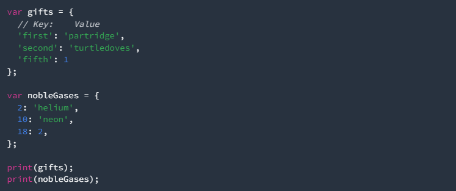

### Langkah 2
Silakan coba eksekusi (Run) kode pada langkah 1 tersebut. Apa yang terjadi? Jelaskan! Lalu perbaiki jika terjadi error. 
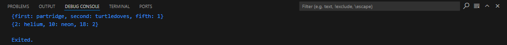 
Kode di atas mendefinisikan sebuah fungsi `main()` yang berisi dua map: `gifts` dan `nobleGases`. Map `gifts` diisi dengan pasangan kunci-nilai yang terdiri dari string sebagai kunci dan juga sebagai nilai, serta sebuah integer. Kunci `'first'` berhubungan dengan nilai `'partridge'`, kunci `'second'` dengan nilai `'turtledoves'`, dan kunci `'fifth'` dengan nilai `1`. Selanjutnya, map `nobleGases` berisi pasangan kunci-nilai yang menggunakan angka sebagai kunci. Dalam map ini, kunci `2` berhubungan dengan nilai `'helium'`, kunci `10` dengan nilai `'neon'`, dan kunci `18` dengan nilai `2`. Setelah kedua map didefinisikan, kode mencetak isi dari masing-masing map ke konsol. Hasilnya akan menampilkan map `gifts` dengan pasangan kunci-nilai yang menjelaskan berbagai hadiah, serta map `nobleGases` yang menunjukkan informasi tentang gas mulia berdasarkan nomor atom mereka. Kode ini menunjukkan penggunaan map untuk menyimpan data dengan pasangan kunci-nilai yang beragam.

### Langkah 3
Tambahkan kode program berikut, lalu coba eksekusi (Run) kode Anda. 
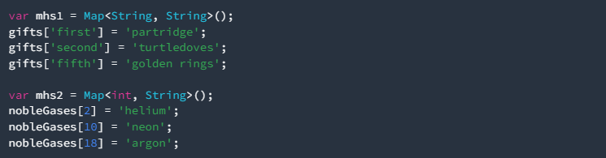 
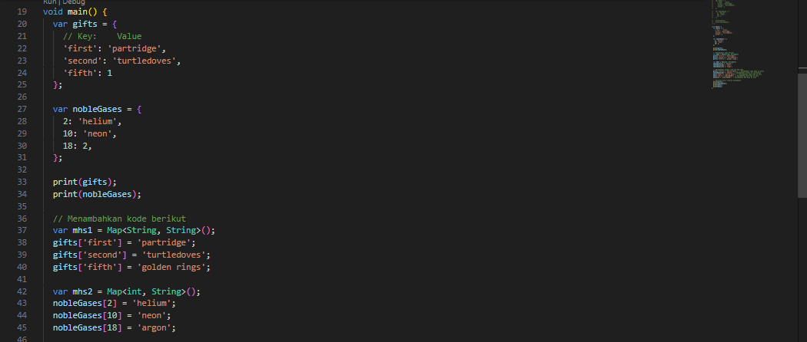 
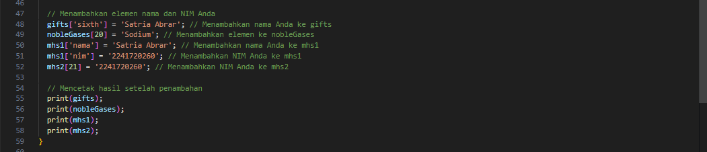 
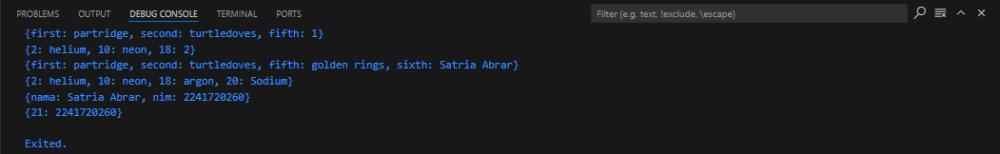 
Kode di atas mendefinisikan fungsi `main()` yang berisi beberapa operasi terkait map di Dart. Pertama, dua map diciptakan: `gifts`, yang berisi pasangan kunci-nilai hadiah dengan kunci berupa string dan nilai yang mencakup string serta integer, dan `nobleGases`, yang berisi pasangan kunci-nilai gas mulia dengan kunci sebagai angka dan nilai sebagai string dan integer. Setelah mencetak isi kedua map tersebut, kode melanjutkan dengan mendefinisikan dua map baru: `mhs1` untuk menyimpan nama dan NIM, serta `mhs2` yang akan menyimpan informasi lain. Dalam proses ini, nilai dalam map `gifts` diperbarui untuk mengganti nilai kunci `'fifth'` dengan `'golden rings'`, dan pada map `nobleGases`, nilai untuk kunci `18` diganti dengan `'argon'` dan kunci baru `20` ditambahkan dengan nilai `'Sodium'`. Kemudian, elemen baru ditambahkan ke `mhs1` untuk menyimpan nama "Satria Abrar" dan NIM "2241720260", sementara `mhs2` mendapatkan kunci `21` dengan nilai NIM Anda. Di akhir, hasil dari semua map dicetak ke konsol, menunjukkan perubahan dan penambahan yang telah dilakukan, serta memastikan bahwa informasi nama dan NIM telah ditambahkan dengan benar ke dalam masing-masing map.

## Praktikum 4

### Langkah 1
Ketik atau salin kode program berikut ke dalam fungsi main(). 
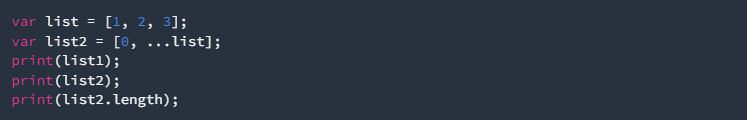

### Langkah 2
Silakan coba eksekusi (Run) kode pada langkah 1 tersebut. Apa yang terjadi? Jelaskan! Lalu perbaiki jika terjadi error. 
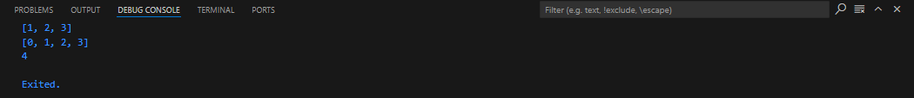 
Kode tersebut mendefinisikan dua list, `list` dan `list2`. Pertama, `var list = [1, 2, 3];` membuat list `list` yang berisi tiga elemen yaitu 1, 2, dan 3. Kemudian, `var list2 = [0, ...list];` mendefinisikan `list2`, yang merupakan list baru dengan elemen 0 diikuti oleh semua elemen dari `list`, sehingga `list2` akan berisi `[0, 1, 2, 3]`. Namun, saat mencoba mencetak `list1` dengan `print(list1);`, kode akan menghasilkan error karena `list1` tidak pernah dideklarasikan. Yang benar adalah mencetak `list`, sehingga seharusnya menggunakan `print(list);`. Setelah perbaikan, output yang diharapkan adalah: pertama, mencetak `[1, 2, 3]` untuk `list`, kedua, mencetak `[0, 1, 2, 3]` untuk `list2`, dan terakhir, mencetak angka `4` sebagai panjang dari `list2`.

### Langkah 3
Tambahkan kode program berikut, lalu coba eksekusi (Run) kode Anda. 
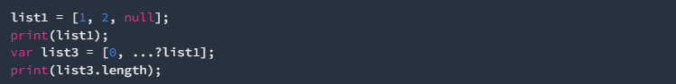
Apa yang terjadi ? Jika terjadi error, silakan perbaiki. 
Tambahkan variabel list berisi NIM Anda menggunakan Spread Operators. Dokumentasikan hasilnya dan buat laporannya! 
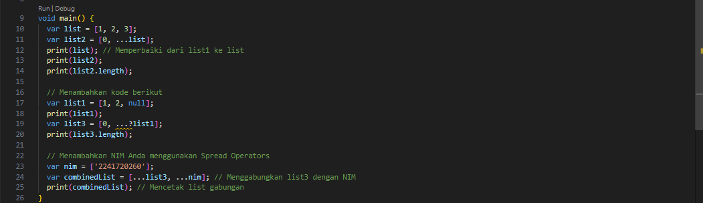 
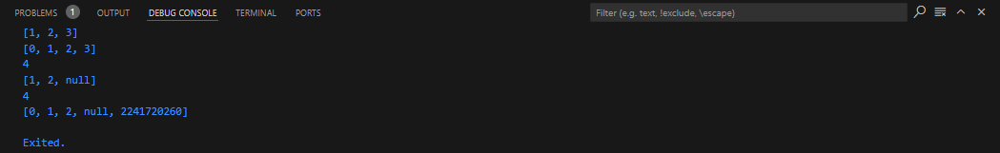

### Langkah 4
Tambahkan kode program berikut, lalu coba eksekusi (Run) kode Anda. 
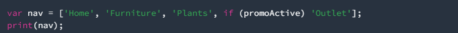 
Apa yang terjadi ? Jika terjadi error, silakan perbaiki. Tunjukkan hasilnya jika variabel promoActive ketika true dan false. 
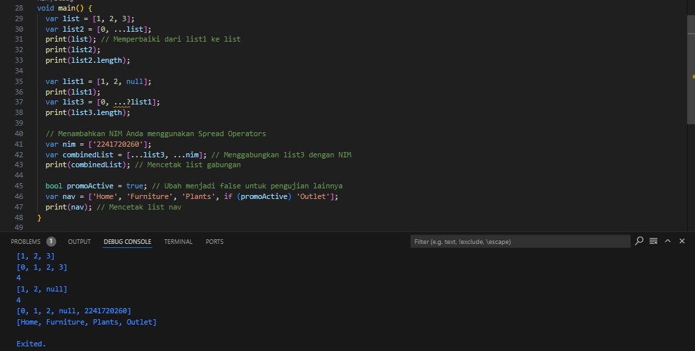

### Langkah 5
Tambahkan kode program berikut, lalu coba eksekusi (Run) kode Anda. 
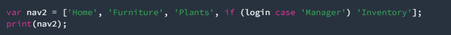 
Apa yang terjadi ? Jika terjadi error, silakan perbaiki. Tunjukkan hasilnya jika variabel login mempunyai kondisi lain. 
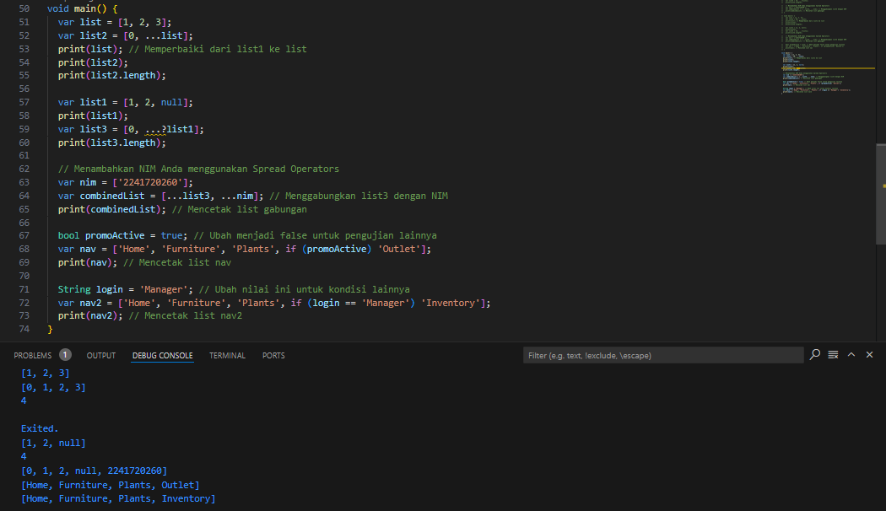

### Langkah 6
Tambahkan kode program berikut, lalu coba eksekusi (Run) kode Anda. 
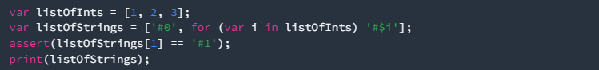 
Apa yang terjadi ? Jika terjadi error, silakan perbaiki. Jelaskan manfaat Collection For dan dokumentasikan hasilnya. 
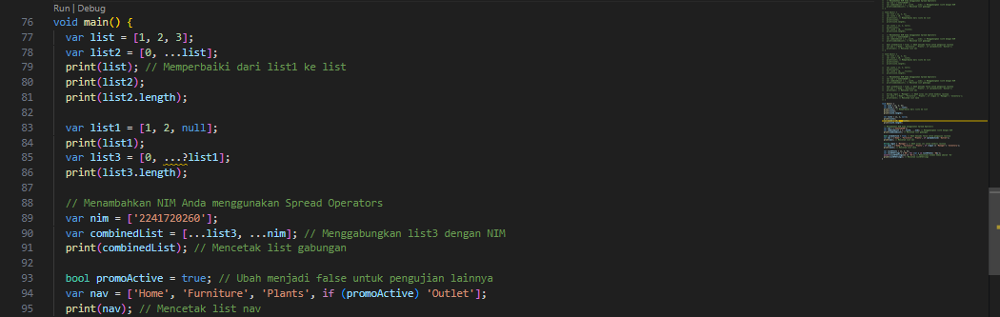
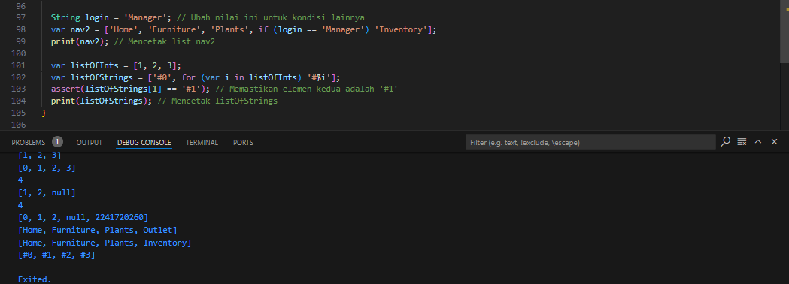

## Praktikum 5

### Langkah 1
Ketik atau salin kode program berikut ke dalam fungsi main(). 
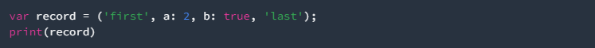 

### Langkah 2
Silakan coba eksekusi (Run) kode pada langkah 1 tersebut. Apa yang terjadi? Jelaskan! Lalu perbaiki jika terjadi error. 
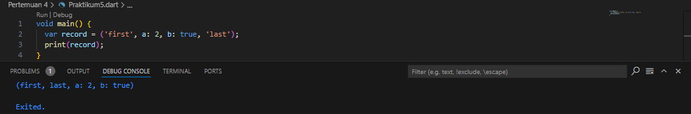 
Kode di atas mendefinisikan sebuah tuple dalam Dart menggunakan sintaks yang disebut "record." Variabel `record` diisi dengan beberapa nilai, yaitu string `'first'`, nilai numerik `2`, nilai boolean `true`, dan string `'last'`. Dalam sintaks ini, elemen pertama dan terakhir adalah string, sementara di antara keduanya terdapat dua nilai yang memiliki nama parameter, yaitu `a` dengan nilai `2` dan `b` dengan nilai `true`. Kode kemudian mencetak isi dari variabel `record`. Outputnya akan menunjukkan semua elemen yang terkandung dalam tuple, yang menggabungkan berbagai tipe data dalam satu entitas. Penggunaan record ini memungkinkan pengelompokan nilai yang berhubungan secara logis dan menjadikannya lebih mudah untuk dikelola sebagai satu kesatuan.

### Langkah 3
Tambahkan kode program berikut di luar scope void main(), lalu coba eksekusi (Run) kode Anda. 
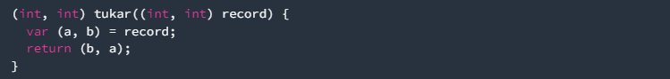 
Apa yang terjadi ? Jika terjadi error, silakan perbaiki. Gunakan fungsi tukar() di dalam main() sehingga tampak jelas proses pertukaran value field di dalam Records. 
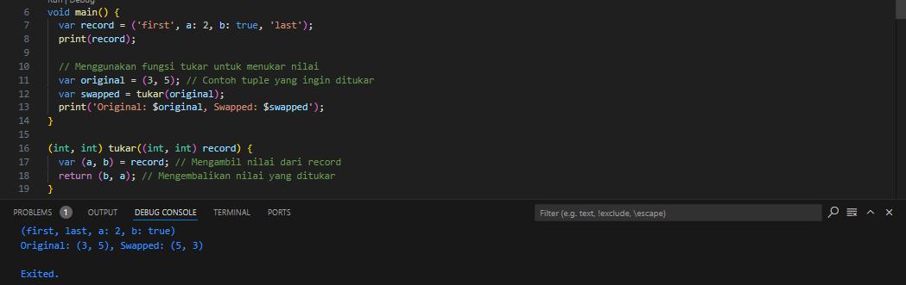

### Langkah 4
Tambahkan kode program berikut di dalam scope void main(), lalu coba eksekusi (Run) kode Anda. 
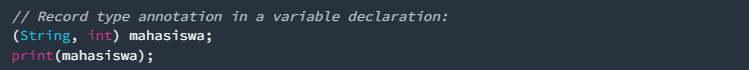 
Apa yang terjadi ? Jika terjadi error, silakan perbaiki. Inisialisasi field nama dan NIM Anda pada variabel record mahasiswa di atas. Dokumentasikan hasilnya dan buat laporannya! 
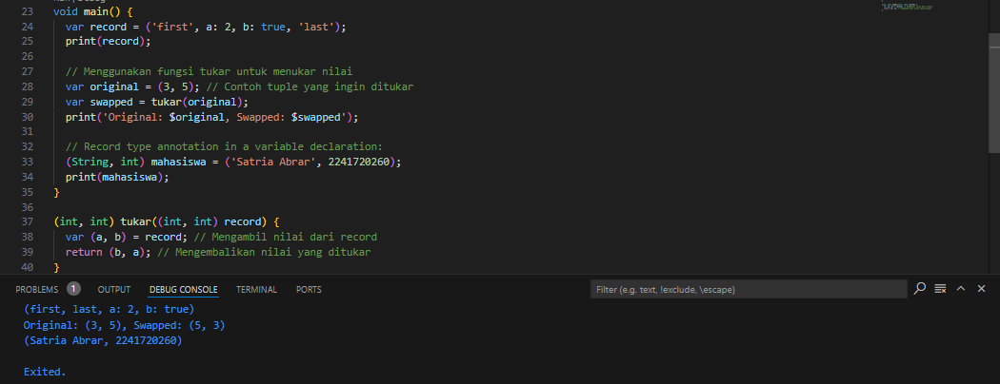 
Kode di atas mendefinisikan fungsi `main()` yang berisi beberapa langkah untuk bekerja dengan record dan tuple dalam Dart. Pertama, sebuah record dibuat dengan mendeklarasikan variabel `record` yang berisi berbagai tipe data: dua string dan dua nilai bertipe integer dan boolean. Record ini kemudian dicetak untuk menunjukkan isinya. Selanjutnya, kode mendemonstrasikan penggunaan fungsi `tukar()` yang menerima tuple bertipe `(int, int)` dan menukar nilainya. Contoh tuple `original` diisi dengan angka `3` dan `5`, dan setelah diproses oleh fungsi `tukar()`, hasil pertukaran disimpan dalam variabel `swapped` dan dicetak. Terakhir, variabel `mahasiswa` dideklarasikan dengan anotasi tipe record `(String, int)` dan diinisialisasi dengan nama 'Satria Abrar' dan NIM `2241720260`, kemudian dicetak untuk menunjukkan nilai yang tersimpan. Kode ini menunjukkan bagaimana cara mendefinisikan, memanipulasi, dan mencetak nilai dari record dan tuple di Dart secara efisien.

### Langkah 5
Tambahkan kode program berikut di dalam scope void main(), lalu coba eksekusi (Run) kode Anda. 
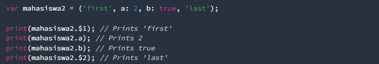 
Apa yang terjadi ? Jika terjadi error, silakan perbaiki. Gantilah salah satu isi record dengan nama dan NIM Anda, lalu dokumentasikan hasilnya dan buat laporannya! 
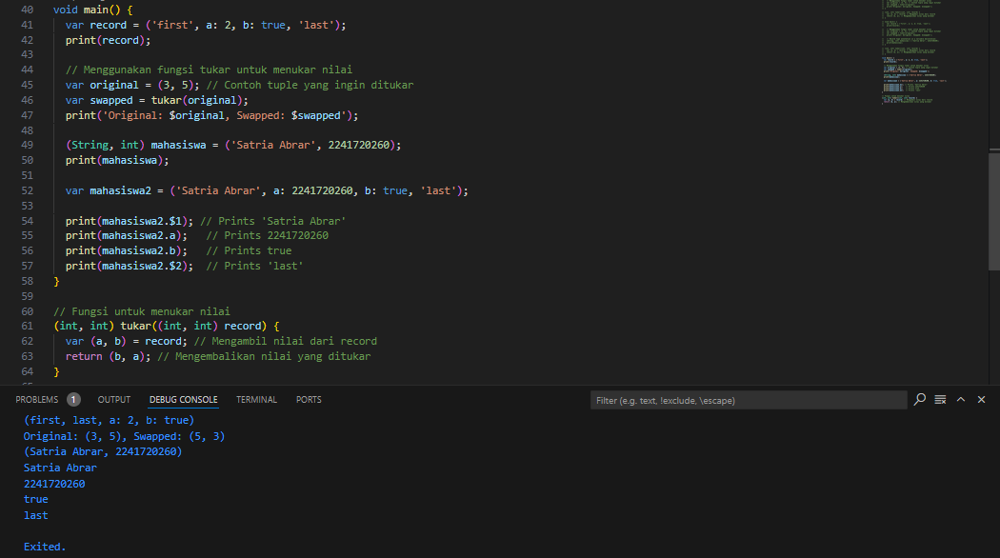 
Kode di atas mendemonstrasikan penggunaan record dan tuple dalam Dart melalui fungsi `main()`. Pertama, sebuah record bernama `record` didefinisikan dengan elemen yang mencakup string dan tipe data lainnya, yang kemudian dicetak untuk menunjukkan isinya. Selanjutnya, kode memperlihatkan fungsi `tukar()` yang dirancang untuk menukar dua nilai dalam tuple; contoh tuple `original` berisi angka `3` dan `5`, dan setelah diproses, hasil pertukaran disimpan dalam variabel `swapped` dan dicetak. Selain itu, variabel `mahasiswa` dideklarasikan dengan tipe record `(String, int)` dan diinisialisasi dengan nama 'Satria Abrar' dan NIM `2241720260`, yang juga dicetak. Pada langkah keempat, variabel `mahasiswa2` didefinisikan dengan nilai yang sama, mengganti elemen record dengan nama dan NIM Anda. Kode ini mencetak setiap elemen dari `mahasiswa2` dengan menggunakan sintaks khusus, seperti `mahasiswa2.$1` untuk mengakses elemen pertama dan `mahasiswa2.a` untuk mengakses NIM. Hasil yang diperoleh menunjukkan cara efektif dalam mendefinisikan dan mengakses data terstruktur menggunakan record di Dart.

## Tugas Praktikum

### 1. Silakan selesaikan Praktikum 1 sampai 5, lalu dokumentasikan berupa screenshot hasil pekerjaan Anda beserta penjelasannya!

### 2. Jelaskan yang dimaksud Functions dalam bahasa Dart!
Functions dalam bahasa Dart adalah blok kode yang dapat dipanggil dan dieksekusi untuk melakukan tugas tertentu. Fungsi memungkinkan pemrogram untuk mengorganisasi kode dengan lebih baik, menghindari pengulangan, dan meningkatkan keterbacaan. Fungsi dapat memiliki parameter untuk menerima input dan mengembalikan nilai sebagai output.

### 3. Jelaskan jenis-jenis parameter di Functions beserta contoh sintaksnya!
- Positional Parameters: Parameter yang diharuskan dan urutannya penting.
void greet(String name) {
  print('Hello, $name!');
}

- Optional Positional Parameters: Parameter yang tidak wajib, menggunakan tanda kurung siku.
void greet(String name, [int age]) {
  print('Hello, $name! You are $age years old.');
}

- Named Parameters: Parameter yang ditentukan dengan nama, menggunakan tanda kurung kurawal.
void greet({required String name, int age}) {
  print('Hello, $name! You are $age years old.');
}

### 4. Jelaskan maksud Functions sebagai first-class objects beserta contoh sintaknya!
Dalam Dart, functions diperlakukan sebagai first-class objects, artinya mereka dapat disimpan dalam variabel, diteruskan sebagai argumen, dan dikembalikan dari fungsi lain. Contoh sintaksnya:
void sayHello() {
  print('Hello!');
}

void main() {
  var greet = sayHello; // Menyimpan fungsi dalam variabel
  greet(); // Memanggil fungsi melalui variabel
}

### 5. Apa itu Anonymous Functions? Jelaskan dan berikan contohnya!
Anonymous functions adalah fungsi yang tidak memiliki nama, sering digunakan sebagai parameter untuk fungsi lain atau untuk callback. Contohnya:
void main() {
  var list = [1, 2, 3];
  var squaredList = list.map((num) => num * num); // Fungsi anonim
  print(squaredList); // Output: (1, 4, 9)
}

### 6. Jelaskan perbedaan Lexical scope dan Lexical closures! Berikan contohnya!
- Lexical Scope: Merupakan aturan di mana fungsi dapat mengakses variabel yang didefinisikan dalam lingkupnya. Contohnya:
void main() {
  var a = 10;
  void inner() {
    print(a); // Mengakses a dari scope luar
  }
  inner();
}

- Lexical Closures: Merupakan fungsi yang "menutup" lingkup di mana ia didefinisikan, sehingga dapat mengakses variabel dari lingkup luar bahkan setelah lingkup tersebut berakhir.
Function makeCounter() {
  int count = 0;
  return () {
    count++;
    return count;
  };
}

void main() {
  var counter = makeCounter();
  print(counter()); // 1
  print(counter()); // 2
}

### 7. Jelaskan dengan contoh cara membuat return multiple value di Functions!
Dart memungkinkan pengembalian beberapa nilai dengan menggunakan tuple atau list. Contoh:
List<int> calculate(int a, int b) {
  return [a + b, a * b]; // Mengembalikan list
}

void main() {
  var results = calculate(3, 5);
  print('Sum: ${results[0]}, Product: ${results[1]}');
}

### 8. Kumpulkan berupa link commit repo GitHub pada tautan yang telah disediakan di grup Telegram!