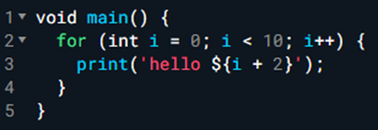
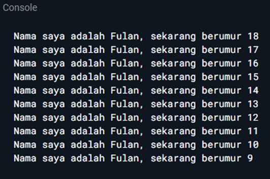
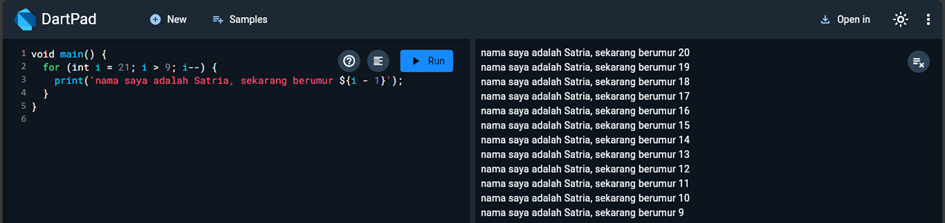

# LAPORAN PRAKTIKUM PEMROGRAMAN DASAR DART – BAG. 1

Nama : Satria Abrar S.W.P  
Kelas : 3B/25

## SOAL 1
Modifikasilah kode pada baris 3 di VS Code atau Editor Code favorit Anda berikut ini agar mendapatkan keluaran (output) sesuai yang diminta!

Ouput yang diminta:

### Jawab
Output saya:

## SOAL 2
Mengapa sangat penting untuk memahami bahasa pemrograman Da`rt sebelum kita menggunakan framework Flutter ? Jelaskan!

### Jawab
Memahami bahasa pemrograman Dart penting sebelum menggunakan Flutter karena Dart adalah dasar dari Flutter. Menguasai Dart memungkinkan kita menulis kode yang benar, menangani pemrograman asinkron, mengelola state, mengoptimalkan kinerja, dan menggunakan paket atau plugin dengan lebih efektif dalam pengembangan aplikasi Flutter.

## SOAL 3
Rangkumlah materi dari codelab ini menjadi poin-poin penting yang dapat Anda gunakan untuk membantu proses pengembangan aplikasi mobile menggunakan framework Flutter.

### Jawab

1. Keunggulan Dart sebagai Bahasa Pemrograman
- Alat Pengembangan: Dart menyediakan alat pengembangan canggih seperti analisis kode, plugin IDE, dan ekosistem paket yang luas. 
- Pengelolaan Memori: Memiliki sistem manajemen memori otomatis yang menangani objek yang tidak terpakai. 
- Penanda Tipe (Opsional): Meningkatkan keamanan dan konsistensi tipe data, walaupun tidak wajib. 
- Tipe Statik: Dart menggunakan tipe yang aman dan inferensi tipe untuk mendeteksi bug saat kompilasi. 
- Portabilitas: Dart mendukung pengembangan untuk web, mobile, dan dapat dikompilasi ke ARM serta x86 secara native.

2. Evolusi Dart
- Peluncuran: Dart diluncurkan pada 2011 dan mencapai stabilitas pada 2013. 
- Perkembangan: Fokus bergeser dari pengembangan web ke mobile dengan Flutter sebagai framework utama. 
- Kekuatan dan Fleksibilitas: Memadukan penanda tipe opsional dengan fitur pemrograman berorientasi objek untuk keseimbangan antara fleksibilitas dan kekuatan.

3. Cara Kerja Dart
- Eksekusi Kode: Dart bisa dijalankan menggunakan Dart VM (dengan JIT atau AOT) atau dikompilasi menjadi JavaScript. 
- JIT (Just-In-Time): Kode dikompilasi sesuai kebutuhan, ideal untuk pengembangan dengan fitur debugging dan hot reload. 
- AOT (Ahead-Of-Time): Kode dikompilasi sebelumnya untuk performa lebih baik, namun tanpa dukungan fitur pengembangan seperti JIT.

4. Struktur Bahasa Dart
- Pemrograman Berorientasi Objek (OOP): Dart mendukung OOP dengan fitur seperti enkapsulasi, pewarisan, dan polimorfisme. 
Operator Dart:
- Operator Aritmatika: Termasuk operator dasar seperti +, -, *, /, dan lainnya. 
- Inkrement dan Dekrement: Operator ++ dan -- untuk menambah atau mengurangi nilai variabel. 
- Operator Kesetaraan dan Relasional: Operator ==, !=, >, <, >=, <= untuk membandingkan nilai. 
- Operator Logika: Operator seperti !, ||, dan && untuk evaluasi kondisi boolean.

## SOAL 4
Buatlah slide yang berisi penjelasan dan contoh eksekusi kode tentang perbedaan Null Safety dan Late variabel ! (Khusus soal ini kelompok berupa link google slide)`