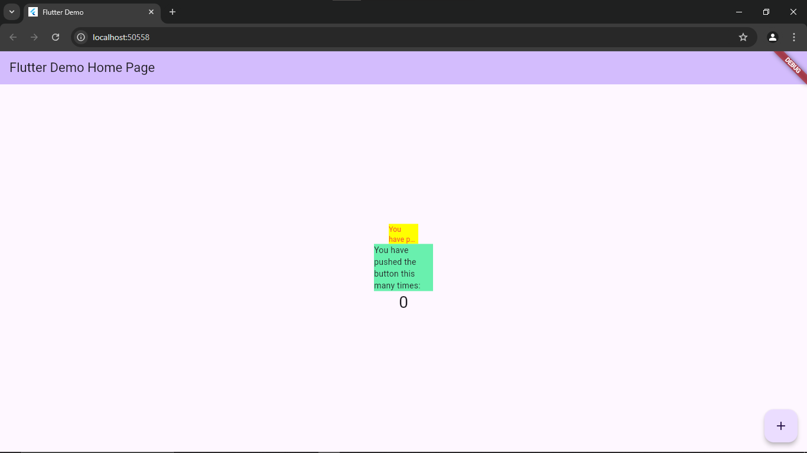

# Capture Hasil Praktikum

## Tugas Praktikum
1. Jelaskan maksud dari langkah 2 pada praktikum tersebut!      
Jawab:     
Perintah flutter pub add auto_size_text digunakan untuk menambahkan package auto_size_text dari pub.dev ke dalam project. Saat perintah ini dijalankan, Flutter akan menambahkan package tersebut ke daftar dependencies di pubspec.yaml, lalu secara otomatis menjalankan flutter pub get untuk mengunduh package yang diperlukan.

2. Jelaskan maksud dari langkah 5 pada praktikum tersebut!      
Jawab:     
Menambahkan variabel text sebagai parameter di RedTextWidget berarti bahwa setiap kali RedTextWidget dipanggil, ia akan membutuhkan nilai text untuk dikirimkan sebagai input.

3. Pada langkah 6 terdapat dua widget yang ditambahkan, jelaskan fungsi dan perbedaannya!       
Jawab:      
Pada langkah 6, terdapat dua Container dengan fungsi berbeda: Container pertama berwarna kuning dan teksnya akan menyesuaikan ukuran agar sesuai dengan lebar 50. Sementara Container kedua berwarna hijau, dan teksnya akan diresize agar cocok dengan lebar 100.

4. Jelaskan maksud dari tiap parameter yang ada di dalam plugin auto_size_text berdasarkan tautan pada dokumentasi ini !        
Jawab:      
- key: Mengatur cara widget ini menggantikan widget lain dalam pohon widget.
- textKey: Menentukan kunci untuk widget teks yang dibuat.
- style: Jika disediakan, mengatur gaya teks yang ditampilkan.
- minFontSize: Batas ukuran teks terkecil yang digunakan untuk menyesuaikan ukuran secara otomatis.
- maxFontSize: Batas ukuran teks terbesar yang digunakan dalam penyesuaian otomatis.
stepGranularity: Ukuran langkah untuk mengubah font agar sesuai dengan batas.
- presetFontSizes: Daftar ukuran font yang bisa digunakan, dalam urutan menurun.
- group: Mengsinkronkan ukuran beberapa AutoSizeText sekaligus.
- textAlign: Mengatur perataan horizontal teks.
textDirection: Menentukan arah teks untuk menginterpretasi perataan.
- locale: Digunakan untuk memilih font yang sesuai dengan lokasi pengguna.
- softWrap: Menentukan apakah teks boleh dipisah pada titik pemutusan baris lunak.
- wrapWords: Menentukan apakah kata yang tidak muat di satu baris akan dibungkus. Defaultnya adalah true.
- overflow: Cara menangani teks yang meluap batas.
overflowReplacement: Menampilkan widget ini jika teks tidak muat dalam batasnya.
- textScaleFactor: Mengatur jumlah piksel font per piksel logis, juga memengaruhi ukuran minimal, maksimal, dan preset font.
- maxLines: Jumlah maksimum baris yang diperbolehkan untuk teks.
- semanticsLabel: Label alternatif untuk teks ini dalam konteks semantik.